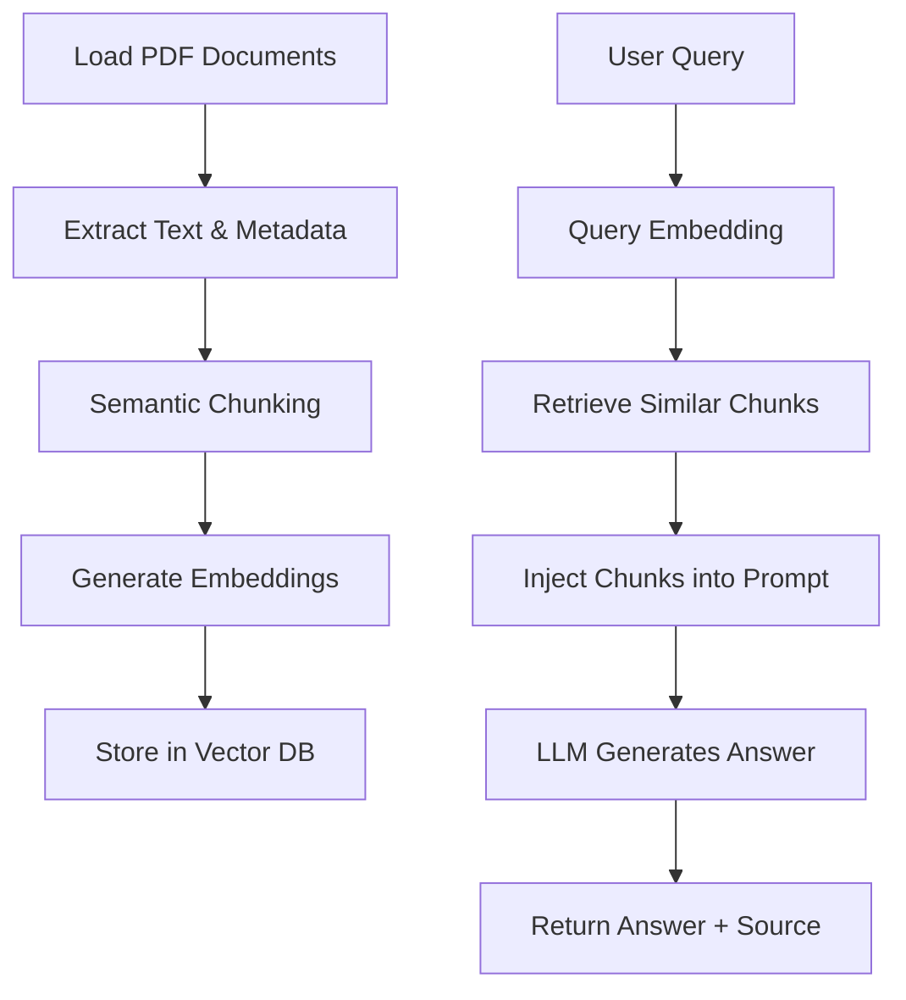
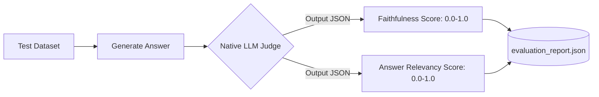

<div align="center">
  <h1> Conversational RAG Engine</h1>
  <p><b>Retrieval-Augmented Generation System with Hybrid Orchestration</b></p>

  <!-- Badges -->
  
  
  
  
  
  
  
  
</div>

<br/>

## 📖 System Overview

This project implements a highly structured, conversational Question & Answer system grounded strictly in user-provided PDF or text documents. 

**The Problem Solved:**
Large Language Models inherently hallucinate or answer from their generalized pre-training data. In enterprise environments (legal, medical, internal HR policies), an AI must **only** answer based on the exact documents provided, or admit it does not know.

**Why Grounded RAG Matters:**
Retrieval-Augmented Generation (RAG) solves this by retrieving the exact paragraphs relevant to a query and forcing the LLM to read them before answering. This system is engineered specifically to prevent hallucinations via strict prompt engineering, isolated vector storage, and an automated evaluation pipeline that mathematically scores the "Faithfulness" of the AI's output.

---

## 🔗 Live Demo / Endpoints

| Service | Status | Endpoint / URL |
|---------|--------|----------------|
| **Frontend App** | 🟢 Live | `https://conversation-rag.streamlit.app/` |
| **Backend API** | 🟢 Live | `rag-backend-student-d7bqgvbxhuacaac2.southindia-01.azurewebsites.net` |
| **Swagger Docs** | 🟢 Live | `https://rag-backend-student-d7bqgvbxhuacaac2.southindia-01.azurewebsites.net/docs` |

---

## 🌟 Highlights

* **Deployment**: Fully deployed to Azure Web Apps.
* **Hybrid Orchestration (LlamaIndex + LangChain)**: Uses LlamaIndex for superior data ingestion/chunking, and LangChain for highly controllable streaming prompt orchestration.
* **Cross-Encoder Reranking Pipeline**: Achieves near-perfect retrieval precision by re-evaluating L2-distance vector similarities using a dense HuggingFace Cross-Encoder.
* **Streaming Architecture**: Instantaneous UI responsiveness via `httpx.stream`, streaming generated tokens word-by-word with zero blocking.
* **LLM-as-a-Judge Evaluation Automation**: Completely native mathematical evaluation pipeline capturing `Faithfulness` and `Answer Relevancy` without relying on expensive, paid APIs.
* **Dynamic ChromaDB Session Isolation**: Automatically provisions isolated vector collections per user session, guaranteeing strict document access boundaries and preventing context bleeding.

---

## 🏛️ System Architecture

The overarching design philosophy of this system is the strict separation of concerns.

![System Architecture]


*Caption: The dual-phase architecture illustrating the isolated Document Upload Pipeline vs the Conversational Chat Pipeline.*

### High-Level Architecture Flowchart


### Document Upload And  Question-Answer Flow (Sequence Diagram) 




---

## 🧬 Hybrid Architecture: LlamaIndex + LangChain

Rather than relying purely on a single framework, this system heavily leverages the best parts of the two industry leaders.

*   **Why LlamaIndex for Data Ingestion?** 
    LlamaIndex possesses superior data connectors, node parsing, and hierarchical indexing capabilities. We use it strictly to handle the recursive chunking, metadata injection, and ChromaDB vector initialization.
*   **Why LangChain for Orchestration?**
    LangChain excels at prompt orchestration, streaming callback handlers, and LLM provider abstractions. We use it strictly to piece together the final RAG prompt and stream the HTTP payload from OpenRouter.

**Engineering Benefit:** This prevents the dreaded "black-box" framework lock-in. By explicitly separating retrieval (LlamaIndex) from generation (LangChain) in our own service layer, we can instantly swap out the LLM provider or the vector database without rewriting the entire pipeline.

---

## 💻 Tech Stack

| Category | Technology | Reasoning |
| :--- | :--- | :--- |
| **Backend** | Python 3.11, FastAPI, Uvicorn | Async capability, auto-generated Swagger UI, Pydantic validation. |
| **Frontend** | Streamlit, httpx | Rapid UI iteration, native HTTP streaming support. |
| **Retrieval** | LlamaIndex, Sentence-Transformers | Robust node parsing; `all-MiniLM-L6-v2` is extremely fast. |
| **Reranking** | Cross-Encoders | `ms-marco-MiniLM-L-6-v2` fixes the precision limits of standard L2 vector search. |
| **Vector DB** | ChromaDB | Embedded, serverless, fast persistent local storage. |
| **LLM Provider** | OpenRouter (`gpt-oss-120b:free`) | Unmatched cost-to-performance ratio for open-source 120B models. |
| **Deployment** | Docker, Docker-Compose, Azure | Standardized environments preventing dependency drift. |
| **Evaluation** | Native LLM-as-a-Judge | Replicates standard RAG evaluation libraries without paid OpenAI API costs. |

---

## 🧠 Why This Architecture? (Engineering Decisions)

*   **Recursive Chunking (`chunk_size=800`, `overlap=120`)**: Standard splitting fragments paragraphs. Recursive chunking gracefully splits by double newlines, then single newlines, ensuring contextual thoughts stay inside a single chunk.
*   **Cross-Encoder Reranking**: Standard L2 distance vector search is "dumb" (it misses semantic context). By retrieving a wide net of 6 chunks and running them through a heavy Cross-Encoder to trim down to the best 3, we achieve near-perfect precision before hitting the LLM context window.
*   **ChromaDB Session Isolation**: Instead of a massive multi-tenant database using metadata filters (which slow down indexing), the `vector_store_service.py` provisions a totally isolated SQLite collection per user session (`session_{uuid}`).
*   **FastAPI + Streamlit Separation**: Tight-coupling the UI to the backend creates monoliths. Exposing a pure REST API allows future migration to React/Next.js seamlessly.

---


## 🗂️ Project Structure

The codebase is organized using strict Domain-Driven Design (DDD) principles:

```text
Conversation-Rag/
├── backend/
│   ├── config/          # Pydantic environment loaders (settings.py)
│   ├── routes/          # FastAPI API endpoint controllers (chat.py, process.py, etc.)
│   ├── schemas/         # Pydantic models acting as strict data contracts
│   ├── services/        # Stateful Business Logic (chunking, embedding, reranking)
│   ├── utils/           # Stateless Helpers (file_handling, extraction)
│   └── main.py          # FastAPI application initialization
├── evaluation/          # Automated metric reports and query datasets
├── frontend/            # Streamlit UI logic and HTTPx client streaming
├── docs/                # Architecture diagrams and deep-dive notes
├── docker-compose.yml   # Multi-container orchestration
├── Dockerfile           # FastAPI Backend containerization
├── Dockerfile.frontend  # Streamlit Frontend containerization
└── requirements.txt     # Python dependencies
```

---

## 🚀 Features Deep Dive

*   **End-to-End Streaming**: Responses aren't batched; tokens are yielded asynchronously via `httpx.iter_lines()` causing the UI to feel instantaneous.
*   **Conversational Memory**: The backend maintains a rolling window (default `memory_max_turns: 5`) of the user's conversation.
*   **Query Rewriting**: If a user says "Tell me more about it", the rewrite service uses the memory window to convert the prompt to "Tell me more about the loan approval policy" *before* hitting the vector database.
*   **Clear Source Attribution**: Every response includes a dropdown displaying the exact chunk index, source filename, and precision rerank score.

---

## 🎨 Frontend UI Showcase


*Caption: The Streamlit chat interface showcasing real-time streaming, chat history, and embedded metadata source expanders.*

The UI abstracts away the massive backend complexity. Users simply upload a document, and the chat interface unlocks. 

---

## 📊 Evaluation Dashboard & LLM-as-a-Judge


*Caption: Example output of the JSON-based evaluation metrics calculating semantic grounding.*

### Evaluation Pipeline Flow


Instead of using the paid `ragas` library, we implemented a **Native LLM-as-a-Judge**. 
A strictly engineered zero-shot JSON prompt forces the 120B parameter model to read its own output alongside the retrieved context and mathematically grade itself:
*   **Faithfulness (0.0 to 1.0):** Is the answer fully supported by the retrieved text?
*   **Answer Relevancy (0.0 to 1.0):** Does the answer actually address the user's question?

---

## 🔌 API Documentation

The backend is fully documented via Swagger UI (`/docs`).

| Endpoint | Method | Purpose |
| :--- | :--- | :--- |
| `/upload` | POST | Accepts PDF/TXT, extracts raw text, provisions UUID session. |
| `/process/{session_id}` | POST | Triggers LlamaIndex chunking, embedding, and ChromaDB indexing. |
| `/chat` | POST | Triggers rewrite, retrieval, reranking, and streams LLM response. |
| `/evaluate/{session_id}`| POST | Runs the LLM-as-a-judge suite across a dataset of test queries. |
| `/health` | GET | Validates Docker container liveness. |

---


---

## 🛡️ Security & Reliability

*   **Strict Hallucination Guardrails**: If the Cross-Encoder drops all chunks (i.e. the document does not contain the answer), the fallback `_mock_generate` explicitly interrupts the LLM and outputs `"I could not find enough information in the document."`
*   **Session Isolation**: By dynamically assigning `get_collection_name(session_id)`, a user's query mathematically cannot query vectors belonging to a different session's PDF.
*   **Environment Variable Protection**: All secrets (OpenRouter API keys) are strictly managed via `pydantic-settings` preventing accidental leakage.

---

## 📈 Scalability & Future Improvements

To take this from enterprise-grade to massive scale, the following architectural steps are planned:
1.  **Hybrid Retrieval (BM25 + Vector)**: Combining dense vector search with sparse keyword search to handle highly specific noun queries (e.g., serial numbers).
2.  **Redis Caching**: Caching semantic query embeddings to completely bypass the LLM for identical repeated questions.
3.  **Kubernetes Deployment**: Replacing Docker Compose with K8s Deployments, scaling the FastAPI pods based on CPU thresholds during heavy embedding spikes.
4.  **Agentic RAG**: Upgrading LangChain orchestration to use Tools, allowing the LLM to decide whether to query a database, search the web, or read a PDF.

---

## 💡 Lessons Learned

*   **RAG Tuning is an Art**: Vector databases are not magic. Tuning `chunk_size` relative to your embedding model's optimal token window is critical. Pushing 1000-word chunks into a model trained on 512 tokens destroys retrieval quality.
*   **Orchestration Frameworks**: Frameworks like LangChain are excellent for rapid prototyping, but can obscure control flow. Wrapping them tightly in isolated service files prevents framework-lock-in.
*   **Cloud Infrastructure Nuances**: What works in a local Docker container (SQLite) fails in the cloud due to fundamental network drive locking behaviors. Infrastructure knowledge is just as important as AI knowledge.

---

## 🎓 Key Engineering Takeaways

1.  **Cross-Encoders act as the ultimate filter.** They are computationally heavy, but running them strictly over a pre-filtered L2 top-6 set provides insane accuracy for negligible latency cost.
2.  **Separation of Concerns enables Agility.** By separating `retrieval_service.py` from `prompt_service.py`, we can radically change how we fetch data without breaking how we instruct the LLM.
3.  **Automated Evaluation is Non-Negotiable.** You cannot improve what you cannot measure. The Native LLM Judge ensures that every prompt tweak is mathematically validated against a golden dataset before merging to production.

---

## 🤝 Professional Conclusion

This project demonstrates what happens when AI prototyping graduates into **Production Software Engineering**. 
By refusing to rely on "magic" one-liner abstractions and instead building a deeply decoupled, mathematically evaluated, and strictly containerized microservices architecture, this RAG engine ensures that AI responses are not just intelligent—but **verifiable, fast, and completely secure.**

Thank you for exploring the architecture.

<div align="center">
  <p><i>Architected for Scale. Engineered for Precision.</i></p>
</div>
