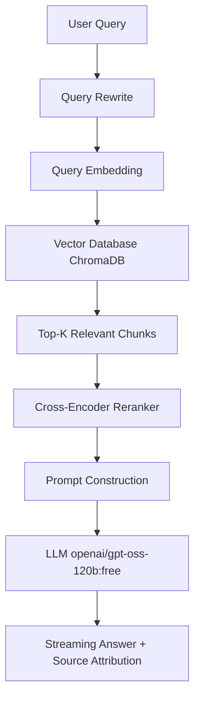
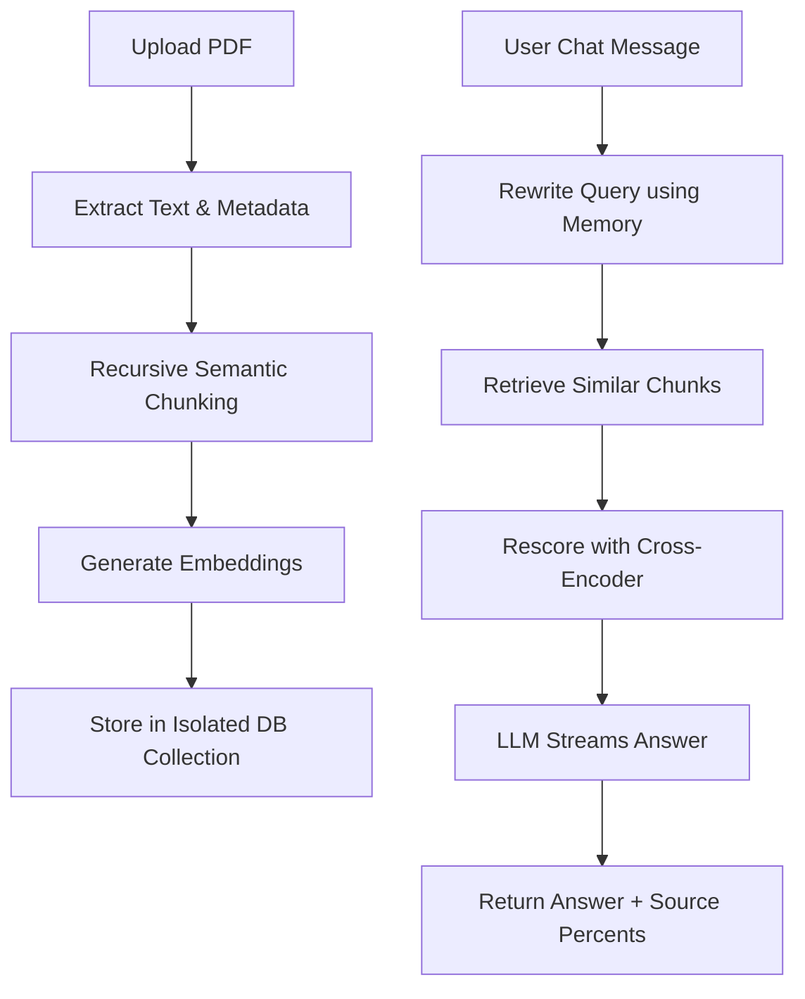
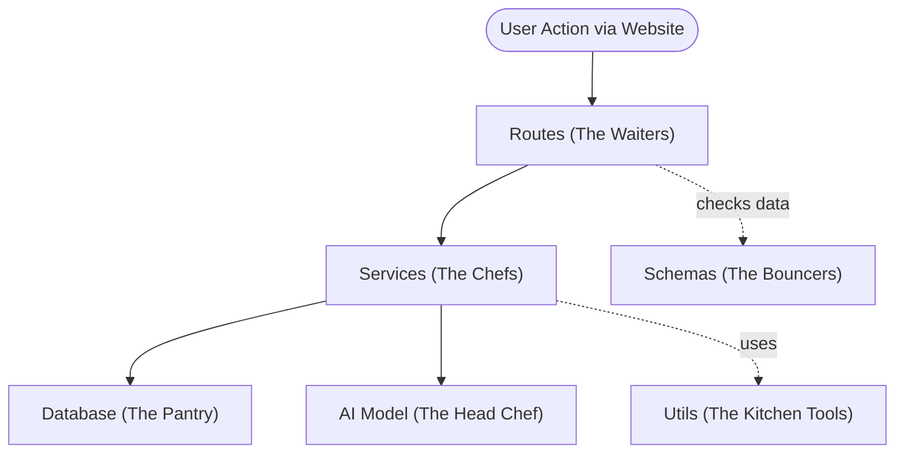
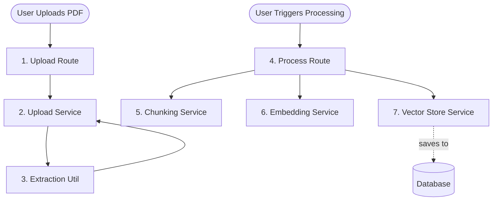
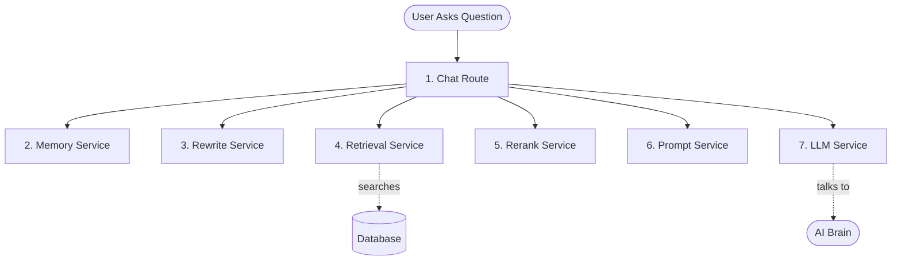
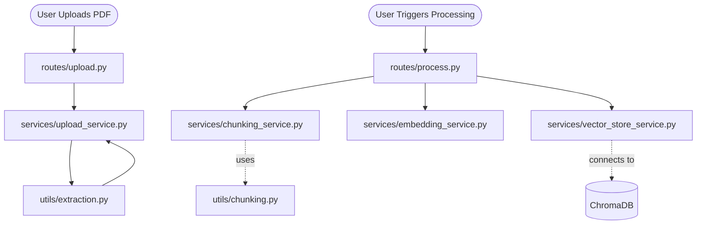
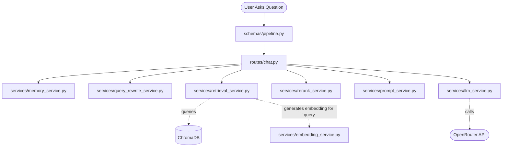

# Conversational Document Q&A RAG System Documentation

Welcome to the documentation for the Conversational Document Q&A RAG (Retrieval-Augmented Generation) System. This solution implements a robust, production-aligned pipeline that combines semantic retrieval, chunking, Cross-Encoder reranking, and LLM-based streaming, with a strict focus on grounded, explainable answers.

---

# Traditional Rag Architecture


# 🏗️ Architecture Overview

This system answers user questions using only the information found in a set of provided PDF documents. The process consists of:

- PDF loading and text extraction
- Recursive character semantic chunking
- Embedding generation and isolated vector storage (ChromaDB)
- Conversational query rewriting for ambiguous pronouns
- Semantic retrieval (L2 Distance) and Cross-Encoder precision reranking
- Prompt construction with retrieved context
- LLM streaming strictly over the retrieved chunks

## System Architecture



> **Key Principle:**  
> The LLM *never* answers from its own internal knowledge. Answers are always grounded in the retrieved document context.

---

# 🔄 Workflow Diagram

This step-by-step workflow visualizes the dual upload and chat pipeline:



---

# 🧩 Backend Code Architecture (Simple Explanation)

Here is a simplified diagram of how the backend code is organized and how the different folders talk to each other. Think of it like a restaurant!



### What does each folder do?

1. **Routes (`backend/routes/`) - *The Waiters***
   These files receive your requests (like "Here is a PDF" or "Answer my question") and direct them to the right "chef" in the kitchen to handle the job.
   
2. **Services (`backend/services/`) - *The Chefs***
   This is where the actual work happens. Instead of one giant file doing everything, the work is split up:
   - One chef handles slicing the PDF into pieces (`chunking_service.py`).
   - One chef organizes the library and database (`vector_store_service.py`).
   - One chef talks to the AI to get the final answer (`llm_service.py`).
   
3. **Schemas (`backend/schemas/`) - *The Bouncers***
   These files check the data coming in and going out to make sure it's correct. If someone tries to ask a question but forgets to include their ID, the schema will reject it immediately.
   
4. **Utils (`backend/utils/`) - *The Kitchen Tools***
   These are small, reusable tools that the chefs use to make their jobs easier (like formatting text or extracting words from a page).

---

## 📄 1. Document Processing Flow (When you upload a PDF)

When you upload a PDF, here is the exact step-by-step journey of what happens behind the scenes:



**Simple Explanation:**
1. You upload the PDF. The **Upload Route** receives it.
2. The **Upload Service** uses an **Extraction Util** to read all the raw text out of the PDF.
3. Once the text is extracted, the **Process Route** takes over.
4. The **Chunking Service** slices the huge wall of text into smaller, readable paragraphs.
5. The **Embedding Service** turns those paragraphs into numbers (so the computer can understand the meaning).
6. The **Vector Store Service** saves those numbers safely in the **Database**.

---

## 💬 2. Chat Generation Flow (When you ask a question)

When you ask a question, the backend goes through this exact process to get your answer:



**Simple Explanation:**
1. You ask a question. The **Chat Route** receives it.
2. The **Memory Service** checks what you were talking about previously (so the AI remembers context).
3. The **Rewrite Service** rewrites your question if it's confusing (e.g., changing "what is it?" to "what is the policy?").
4. The **Retrieval Service** searches the **Database** for the most relevant paragraphs from your PDF.
5. The **Rerank Service** double-checks those paragraphs and picks the absolute best ones.
6. The **Prompt Service** bundles your question and the best paragraphs together like an instruction manual.
7. Finally, the **LLM Service** hands the instruction manual to the **AI Brain**, gets the answer, and streams it back to your screen!

---

# 📦 Project Structure & File Responsibilities

| File / Folder                        | Purpose                                                        |
|--------------------------------------|----------------------------------------------------------------|
| `.env`                               | Stores OpenRouter API token                                    |
| `requirements.txt`                   | Lists required Python dependencies                             |
| `backend/config/settings.py`         | Pydantic environment loaders and configuration                 |
| `backend/routes/`                    | FastAPI endpoint controllers (chat, process, upload)           |
| `backend/services/chunking_service.py`| Splits documents into semantically meaningful chunks           |
| `backend/services/embedding_service.py`| Embedding model loader and semantic generation              |
| `backend/services/retrieval_service.py`| Executes L2 semantic search against ChromaDB                |
| `backend/services/rerank_service.py` | Rescores chunks using Cross-Encoders                         |
| `backend/services/llm_service.py`    | Streaming Text Generation for the retrieved context            |
| `backend/utils/evaluation.py`        | Native LLM-as-a-judge strict grading prompts                   |
| `frontend/app.py`                    | Streamlit application entry point and chat UI                  |

---

# 📂 .env

This file stores your OpenRouter API token, required for accessing hosted LLMs.

```env
OPENROUTER_API_KEY=sk-or-v1-...
```

- **Purpose:** Securely store credentials.
- **Usage:** Loaded by `pydantic-settings` in `backend/config/settings.py`, required for LLM endpoint access.

---

# ⚙️ requirements.txt

Lists all dependencies needed to run the system.

```txt
fastapi
uvicorn
streamlit
pydantic
pydantic-settings
python-multipart
pypdf
langchain-text-splitters
chromadb
sentence-transformers
huggingface-hub
httpx
```

- **Purpose:** Declarative environment setup.
- **Notable Packages:**
  - `fastapi` & `streamlit`: Core API and UI frameworks.
  - `sentence-transformers`: For embeddings and Cross-Encoder reranking.
  - `chromadb`: Fast vector DB with metadata support.
  - `pypdf`: Lightweight offline PDF extraction.

---

# ✂️ backend/services/chunking_service.py

Provides semantic chunking logic using LangChain's text splitters.

```python
from langchain_text_splitters import RecursiveCharacterTextSplitter

def chunk_document(text: str, session_id: str) -> List[ChunkMetadata]:
    splitter = RecursiveCharacterTextSplitter(
        chunk_size=500,
        chunk_overlap=50,
        separators=["\n\n", "\n", " ", ""]
    )
    # Splits while preserving paragraph boundaries
```

- **Purpose:** Splits documents into semantically meaningful text chunks.
- **Why recursive chunking?**
  - Preserves meaning across sentence and paragraph boundaries.
  - Reduces chances of splitting explanations or tables.

---

# 🧬 backend/services/embedding_service.py

Loads the embedding model for ChromaDB vector generation.

```python
from sentence_transformers import SentenceTransformer

model = SentenceTransformer("all-MiniLM-L6-v2")

def generate_embeddings(chunks: List[str]) -> List[List[float]]:
    """
    Generate dense vectors for document chunks.
    """
    return model.encode(chunks).tolist()
```

- **Purpose:** 
  - Loads the fast `all-MiniLM-L6-v2` transformer for semantic embeddings.
  - Converts text into 384-dimensional arrays for similarity search.

---

# 🎯 backend/services/rerank_service.py

Applies a Cross-Encoder to drastically improve retrieval precision.

```python
from sentence_transformers import CrossEncoder

reranker = CrossEncoder("cross-encoder/ms-marco-MiniLM-L-6-v2")

def rerank_chunks(query: str, chunks: List[RetrievedChunk]) -> List[RetrievedChunk]:
    # Calculates exact relevance between the query and each individual chunk
    scores = reranker.predict([[query, c.text] for c in chunks])
    # Returns sorted chunks
```

- **Purpose:** 
  - Overcomes the limitations of standard L2 Distance vector search.
  - Acts as a highly accurate filter before passing context to the LLM.

---

# 🧠 backend/services/llm_service.py

Interacts with OpenRouter for streaming generation.

```python
import httpx
import json

def generate_answer_stream(prompt: str):
    """
    Yields tokens as they stream in from the OpenRouter API.
    """
    with httpx.stream("POST", url, headers=headers, json=payload) as r:
        for chunk in r.iter_lines():
            # Parse JSON and yield raw text tokens
            yield token
```

- **Purpose:** 
  - Generates natural language answers based on retrieved context.
  - Streams tokens instantly for a highly responsive UI.
- **Notable:** 
  - Connects to the `openai/gpt-oss-120b:free` model.
  - Falls back to deterministic local mock generation if keys are missing.

---

# 🚀 frontend/app.py

Entry point for the Streamlit UI application.

```python
import streamlit as st
import httpx

st.title("Conversational RAG Assistant")

if prompt := st.chat_input("Ask a question about your document"):
    st.chat_message("user").write(prompt)
    
    with st.chat_message("assistant"):
        answer_placeholder = st.empty()
        # Streams the answer word-by-word via HTTPX
        for chunk in httpx.stream("POST", "http://127.0.0.1:8000/chat"):
            answer_placeholder.markdown(full_answer)
```

- **Purpose:** 
  - Provides a beautiful, interactive web UI.
  - Handles real-time HTTP streaming to render responses word-by-word.

---

# 🖥️ API Endpoints

The system is fully decoupled. The backend operates as a pure REST API.

## /chat (POST) – Ask a Question

### "Chat Pipeline" Endpoint (POST /chat)

```api
{
    "title": "Ask a Question (Streaming)",
    "description": "Submit a question to the RAG system. Returns a streaming response yielding tokens, followed by a __METADATA__ separator with sources.",
    "method": "POST",
    "baseUrl": "http://127.0.0.1:8000",
    "endpoint": "/chat",
    "headers": [
        {
            "key": "Content-Type",
            "value": "application/json",
            "required": true
        }
    ],
    "bodyType": "json",
    "requestBody": "{\n  \"session_id\": \"uuid-1234\",\n  \"message\": \"What is the loan approval process?\"\n}",
    "responses": {
        "200": {
            "description": "Streaming Chunked Response",
            "body": "The loan approval process involves... \n__METADATA__\n{\"sources\": [{\"chunk_id\": \"1\", \"relevance_score\": 5.4, \"source_file\": \"policy.pdf\"}]}"
        }
    }
}
```

---

# 🧩 Key Engineering Takeaways

```card
{
  "title": "Cross-Encoder Reranking",
  "content": "Standard vector search misses context. By fetching 6 chunks and applying a Cross-Encoder, we achieve near-perfect retrieval precision."
}
```

```card
{
  "title": "Native LLM-as-a-Judge",
  "content": "We bypassed expensive evaluation frameworks by writing a strict zero-shot JSON prompt that forces the 120B LLM to grade its own Faithfulness mathematically."
}
```

```card
{
  "title": "Clean Architecture",
  "content": "Strictly separating stateless utils/ from stateful services/ ensures the codebase is highly testable, modular, and production-ready."
}
```

---

# 📝 Summary

This project demonstrates a production-aligned design for document-grounded question answering:

- Recursive chunking for high retrieval quality
- Isolated ChromaDB collections per session
- Cross-Encoder rescoring for maximum precision
- LLM reasoning strictly over provided context with live streaming
- Native, automated evaluation dashboards

All engineering decisions were made based on real-world trade-offs for reliability, transparency, and simplicity.

---

# 🎓 Further Reading

- [FastAPI Documentation](https://fastapi.tiangolo.com/)
- [ChromaDB Documentation](https://docs.trychroma.com/)
- [Sentence Transformers](https://www.sbert.net/)
- [Streamlit Chat Elements](https://docs.streamlit.io/library/api-reference/chat)

---

# 🚫 Failure Modes

**Expected Failure:**  
If a query is out-of-domain (e.g., "Explain quantum entanglement" when not present in any PDF), the system safely returns:

> "I could not find enough information in the document."

This confirms that the system is robust against hallucination and only answers from the provided knowledge base. The Native LLM Judge will automatically grade this refusal with a `1.0` for Faithfulness.


# RAG Backend Architecture Overview

The backend is structured using a clean separation of concerns, typical of a well-organized FastAPI application. Here is how all the files connect together.

## 1. Directory Structure
The `backend/` folder is divided into specific layers:

- **`main.py`**: The entry point. It initializes the FastAPI app and registers all the API endpoints (routers).
- **`routes/`**: Contains the API endpoints exposed to the user. These receive requests and pass them down to the services.
- **`services/`**: Contains the core business logic. This is where the actual RAG operations (chunking, embedding, querying LLMs) happen.
- **`schemas/`**: Pydantic models that define the shape of incoming requests and outgoing responses (data validation).
- **`utils/`**: Helper functions used by services (e.g., specific string manipulation or formatting).
- **`config/`**: Contains configuration and environment variable settings (`settings.py`).

## 2. Document Processing Flow

When a user uploads a document, the flow traverses these files:



1. **Upload**: `routes/upload.py` accepts the PDF. It calls `services/upload_service.py`, which uses `utils/extraction.py` to extract text from the PDF.
2. **Process**: `routes/process.py` takes the extracted text and orchestrates:
   - **Chunking**: Calls `services/chunking_service.py` (which uses LangChain).
   - **Embedding**: Calls `services/embedding_service.py` (which uses SentenceTransformers).
   - **Storage**: Calls `services/vector_store_service.py` to save the embeddings into ChromaDB.

## 3. Chat / Generation Flow

When a user asks a question, it triggers the most complex pipeline in the app:



1. **Validation**: The request is validated against `schemas/pipeline.py`.
2. **Endpoint**: `routes/chat.py` receives the request and acts as the orchestrator.
3. **Memory**: It fetches chat history from `services/memory_service.py`.
4. **Rewrite**: It calls `services/query_rewrite_service.py` to rephrase the question based on chat history.
5. **Retrieve**: It uses `services/retrieval_service.py` to fetch relevant chunks from ChromaDB.
6. **Rerank**: It refines the chunks using `services/rerank_service.py`.
7. **Prompt**: It builds the final text prompt using `services/prompt_service.py`.
8. **Generation**: It sends the prompt to the AI model via `services/llm_service.py` and streams the response back to the user.

## Summary

In short: **Routes** orchestrate the flow, **Services** do the heavy lifting, **Schemas** ensure data is correct, and everything is tied together in `main.py`.
