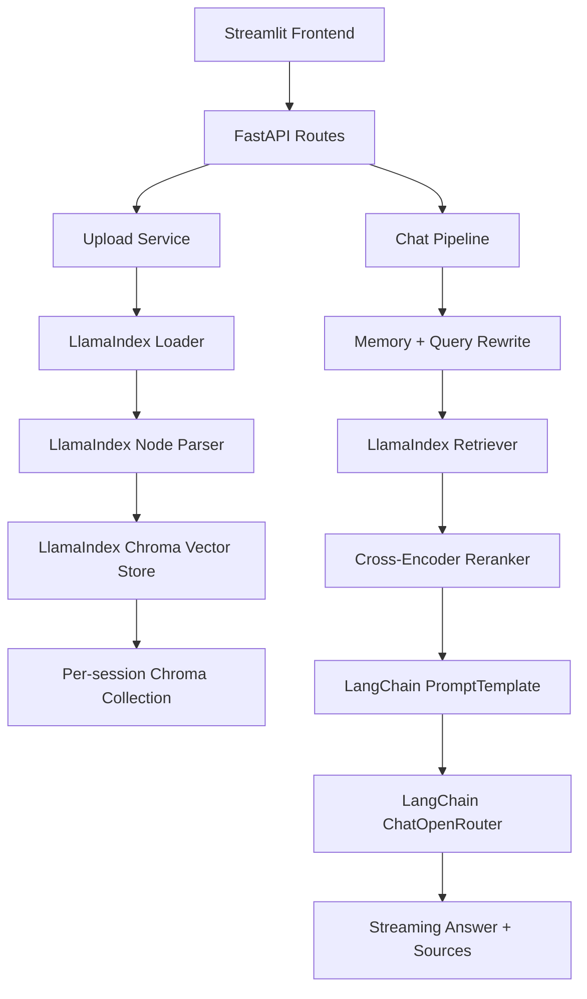

# Production Hybrid RAG Architecture

This project keeps the existing Streamlit + FastAPI product surface while moving the RAG internals to a hybrid architecture:

- **LlamaIndex**: document loading, node parsing, ChromaDB indexing, retrieval.
- **LangChain**: prompt templating and OpenRouter LLM orchestration.
- **Existing services**: session isolation, query rewrite, Cross-Encoder reranking, streaming response metadata, and evaluation.

## Production Notes

- Keep `RAG_ENGINE=llamaindex` and `LLM_ORCHESTRATION=langchain` in production.
- Set `APP_ENV=production`; `/ready` will return HTTP 503 if required runtime dependencies are missing or the OpenRouter key is not configured.
- Use a persistent mounted path for `CHROMA_DB_PATH` and `UPLOAD_DIR`.
- For multi-worker deployments, replace the current in-memory chat memory with Redis, Postgres, or another shared store.
- Keep `LEGACY_RAG_FALLBACK_ENABLED=false` in strict production if you want startup/configuration issues to fail loudly instead of falling back.
